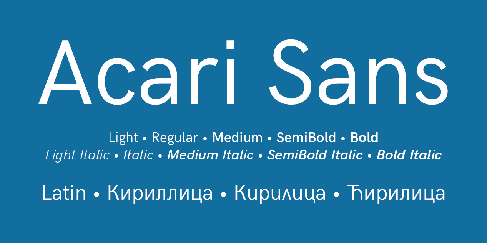

  
  
# Acari Sans

[![][Fontbakery]](https://googlefonts.github.io/googlefonts-project-template/fontbakery/fontbakery-report.html)
[![][Universal]](https://googlefonts.github.io/googlefonts-project-template/fontbakery/fontbakery-report.html)
[![][GF Profile]](https://googlefonts.github.io/googlefonts-project-template/fontbakery/fontbakery-report.html)
[![][Outline Correctness]](https://googlefonts.github.io/googlefonts-project-template/fontbakery/fontbakery-report.html)
[![][Shaping]](https://googlefonts.github.io/googlefonts-project-template/fontbakery/fontbakery-report.html)

[Fontbakery]: https://img.shields.io/endpoint?url=https%3A%2F%2Fraw.githubusercontent.com%2Fgooglefonts%2Fgooglefonts-project-template%2Fgh-pages%2Fbadges%2Foverall.json
[GF Profile]: https://img.shields.io/endpoint?url=https%3A%2F%2Fraw.githubusercontent.com%2Fgooglefonts%2Fgooglefonts-project-template%2Fgh-pages%2Fbadges%2FGoogleFonts.json
[Outline Correctness]: https://img.shields.io/endpoint?url=https%3A%2F%2Fraw.githubusercontent.com%2Fgooglefonts%2Fgooglefonts-project-template%2Fgh-pages%2Fbadges%2FOutlineCorrectnessChecks.json
[Shaping]: https://img.shields.io/endpoint?url=https%3A%2F%2Fraw.githubusercontent.com%2Fgooglefonts%2Fgooglefonts-project-template%2Fgh-pages%2Fbadges%2FShapingChecks.json
[Universal]: https://img.shields.io/endpoint?url=https%3A%2F%2Fraw.githubusercontent.com%2Fgooglefonts%2Fgooglefonts-project-template%2Fgh-pages%2Fbadges%2FUniversal.json

Acari Sans (named after a fish native from Central and South America, also referred to as 'cascudo') is forked from Hanken Grotesk Version 1.045, last version that supports Cyrillic. The first modifications were duplexed tabular numerals, and fixing of some glyphs.  
In the new versions of Acari Sans (starting from v.1.070), the UPM value has been changed to 2048, which creates an entirely new geometry of glyphs. The H-height is now 1448 and the x-height is 1064. The Acari Sans family is based on 3 masters (Light, Bold, Black) with which are created the following weights: Light=300, Regular=400, Medium=500, SemiBold=600, Bold=700, ExtraBold=800, Black=900.  

## About

Description of you and/or organisation goes here.

## Building

Fonts are built automatically by GitHub Actions - take a look in the "Actions" tab for the latest build.

If you want to build fonts manually on your own computer:

* `make build` will produce font files.
* `make test` will run [FontBakery](https://github.com/googlefonts/fontbakery)'s quality assurance tests.
* `make proof` will generate HTML proof files.

The proof files and QA tests are also available automatically via GitHub Actions - look at `https://yourname.github.io/your-font-repository-name`.

## Changelog

When you update your font (new version or new release), please report all notable changes here, with a date.
[Font Versioning](https://github.com/googlefonts/gf-docs/tree/main/Spec#font-versioning) is based on semver. 

* December 12-26, 2023 Version 1.074R/1.072I
  - MAJOR: Converted currencies to have the same width as zero-nine. Reflow may occur
  - MAJOR: Added proportional figures
  - MINOR: Adjusts in A/abrevetilde and A/abrevegrave

* January 9-26, 2024 Version 1.076R/1.074I
  - Fixes in 1 and 2
  - Enlarged G crossbar
  - Move up inferior figures in Italic only
    

## License

This Font Software is licensed under the SIL Open Font License, Version 1.1.
This license is available with a FAQ at
https://scripts.sil.org/OFL

## Examples

See [images](/images/) and [Gallery](/images/Gallery.md).

## Repository Layout

This font repository structure is inspired by [Unified Font Repository v0.3](https://github.com/unified-font-repository/Unified-Font-Repository), modified for the Google Fonts workflow.  
  
Localfonts projects
-------------------
  
The primarily aim of the project **LOCALFONTS** is to extend Cyrillic in fonts published under licenses which permit modifications and derivative works by adding Cyrillic local forms (Bulgarian, Serbian, Macedonian, Ukrainian etc.).  
The **Localfonts** project consists of the following fonts:

+ [Acari Sans](https://github.com/StefanPeev/acari-sans/tree/local) 
+ [Common Sans](https://github.com/StefanPeev/Common-Sans)  
+ [Common Serif](https://github.com/StefanPeev/Common-Serif)  
+ [Coval](https://github.com/StefanPeev/coval)  
+ [Dinish](https://github.com/StefanPeev/dinish/tree/cyrillic)  
+ [Ezerovo](https://github.com/StefanPeev/Ezerovo)  
+ [Gabriela](https://github.com/StefanPeev/Gabriela)  
+ [Grazhdanskiy Shrift](https://github.com/StefanPeev/Grazhdanskiy-Shrift)  
+ [Involve](https://github.com/StefanPeev/Involve)  
+ [Libra Sans](https://github.com/StefanPeev/Libra-Sans)  
+ [Linguistics Pro](https://github.com/StefanPeev/Linguistics-Pro)  
+ [Listopad | Open Sans](https://github.com/StefanPeev/opensans/tree/local)  
+ [Open Sans](https://github.com/StefanPeev/opensans/tree/local)  
+ [Perun](https://github.com/StefanPeev/Perun)  
+ [Pliska](https://github.com/StefanPeev/Pliska)  
+ [Prolog | Libre Moretus](https://github.com/StefanPeev/libre-moretus/tree/prolog)  
+ [Repo](https://github.com/StefanPeev/Repo)  
+ [Scada | Cascade](https://github.com/StefanPeev/Scada-Cascade/tree/local)  
+ [Spritulo](https://github.com/StefanPeev/spritulo)  
+ [Terminalia](https://github.com/StefanPeev/Terminalia)  
+ [Veleka](https://github.com/StefanPeev/Veleka)  
  
Donations
---------

If you apreciate the project, please feel free to donate: [PayPal](https://www.paypal.me/localfonts).

